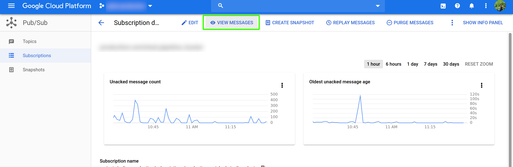
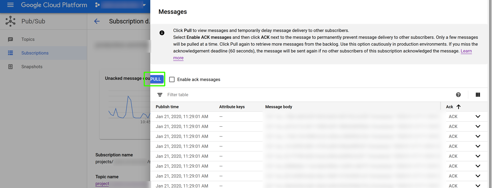

emulator-tools
===============

Google Cloud provides [emulators](https://cloud.google.com/sdk/gcloud/reference/beta/emulators/) for testing cloud components such as PubSub and BigTable locally without having to connect to a remote instance. Here you will find tools for interacting with emulators easily, used for setting up your local environment for development.

Install using pip (Python 3):

```
pip install emulator-tools
```

# Emulators

## Basic Setup

Emulators come with the [`gcloud`](https://cloud.google.com/sdk/install) SDK. The basic setup for all emulators is very similar. You have to first start up the emulator and then make sure to set the environment variables for the project that's going to use these emulators as well as for the emulator tools to connect to the emulator rather than your remote project.

### Start

Start an emulator (set the project according to what your code uses)

```
gcloud beta emulators pubsub start --log-http --project your-project-id
gcloud beta emulators bigtable start --log-http --host-port=localhost:8428 --project your-project-id
```

### Set Environment

Then set the environment variables for your program before running it. You also need to set the environment for using emulator tools.

```
$(gcloud beta emulators pubsub env-init)
echo $PUBSUB_EMULATOR_HOST # verify the environment variable is set
$(gcloud beta emulators bigtable env-init)
echo $BIGTABLE_EMULATOR_HOST
```

# Tools

To use the tools, you need to install python and the requirements, if using `pyenv`:

```
pyenv install $(cat .python-version)
pyenv local
pip install -r requirements.txt
```

## PubSub

After [starting the emulator](#start), [set the environment](#set-environment) and get started with setting up pubsub.

First off, check to make sure you are connected to your emulator and not the production instance.

```
emulator-tools pubsub <project-id> list-topics
```

The result should be empty, otherwise if you see a list of topics, you are connected to production! Make sure your environment variables are set properly.
After you have checked the connection, you can create topics as needed by the component (you can usually find these topic names in configuration files of the app):

```
emulator-tools pubsub <project-id> create-topic <topic-name>
```

Then create subscriptions:
```
emulator-tools pubsub <project-id> create-subscription <topic-name> <subscription-name>
```

You can check to validate your topic and subscription:
```
emulator-tools pubsub <project-id> list-topics

emulator-tools pubsub <project-id> list-subscriptions-in-topic <topic-name>

emulator-tools pubsub <project-id> list-subscriptions-in-project
```

Afterwards, you can test publishing a message and receiving it:
```
cat sample-message.json | emulator-tools pubsub <project-id> publish <topic-name>

emulator-tools pubsub <project-id> receive-messages <subscription-name>
```

If you see "Received message: Message {" including the content of the file `sample.json`, you are all set!

You can now connect your project to this emulator and use these scripts to send envelopes to it.

If you want a sample envelope for your project, you can get on by going to the production pubsub subscription for the app and use "View Messages" and then "Pull" to get a sample message. Sometimes you might have to click "Pull" multiple times to get some messages. Just take care NOT to "Ack" the message.




## BigTable

After [starting the emulator](#start), [set the environment](#set-environment) and get started with setting up BigTable.

First off, check to make sure you are connected to your emulator and not the production instance.

```
emulator-tools bigtable <project-id> <instance-id> list-tables
```

The result should be empty, otherwise if you see a list of tables, you are connected to production! Make sure your environment variables are set properly.
After you have checked the connection, you can create tables as needed by the component (you can usually find these table names in configuration files of the app). For creating the table you need to provide the list of column families and column types in a JSON format:

```
{
  "column_families": [{
    "name": "i",
    "columns": [{
      "key": "id",
      "type": "long"
    }, {
      "key": "score",
      "type": "double"
    }, {
      "key": "title",
      "type": "string"
    }]
  }, {
    "name": "m",
    "columns": [{
      "key": "namespace",
      "type": "string"
    }]
  }]
}
```

```
cat sample-table.json | emulator-tools bigtable <project-id> <instance-id> create-table <table-name>
```

You can now insert a new row using json files of this format (see `sample-row.json`):
```
{
  "rows": [
    {
      "rowkey": "testing#12345",
      "columns": [
        {
          "key": "i:id",
          "value": 1234,
          "timestamp": 1579607960.80492
        },
        {
          "key": "i:title",
          "value": "Here's a test title for you"
        },
        {
          "key": "i:score",
          "value": 1.5
        },
        {
          "key": "m:namespace",
          "value": "core"
        }
      ]
    }
  ]
}
```

```
cat sample-row.json | emulator-tools bigtable <project-id> <instance-id> write <table-name> sample-table.json
```

To read the rows:
```
emulator-tools bigtable <project-id> <instance-id> read <table-name> sample-table.json

# for specific rowkeys
emulator-tools bigtable <project-id> <instance-id> read <table-name> sample-table.json --rowkey testing:.*
```

You can also use [cbt](https://cloud.google.com/bigtable/docs/cbt-reference), the official tool for interacting with BigTable to interact with your emulated environment. Just be careful to set the environment properly and not to interact with the production instance.

```
# list tables
cbt -project <project-id> -instance <instance-id> ls

# list column families in table
cbt -project <project-id> -instance <instance-id> ls <table-name>

# read rows
cbt -project <project-id> -instance <instance-id> read <table-name>
```

If you want some sample data for your project, you can import this data from the production instance to your local emulator. To do that, read from the remote instance and write it down to a file, then write it to your local emulator in another terminal with the correct environment variables set.

```
# in a terminal with no emulator env variables
emulator-tools bigtable <project-id> <instance-id> read <table-name> sample-table.json --limit 5 --json > data.json

# in a terminal with emulator environment set
cat data.json | emulator-tools bigtable <project-id> <instance-id> write <table-name> sample-table.json
```

You should then be able to inspect this data in your emulated environment:
```
emulator-tools bigtable <project-id> <instance-id> read <table-name> sample-table.json
```

# Services Model

The way we use these scripts at AYLIEN is that we have a `setup-emulators.sh` script for each of our services interacting with BigTable and PubSub, and these scripts are responsible for setting up the necessary tables, topics, subscriptions and sending a sample message upon running. This means getting started is as easy as running the app with emulator environment variables and running `setup-emulators.sh`.

A sample script might look like this:

```
$(gcloud beta emulators bigtable env-init)
$(gcloud beta emulators pubsub env-init)

project="awesome-project-staging"

emulator-tools pubsub $project create-topic test
emulator-tools pubsub $project create-subscription test test

cat ./messages/love-letter.json | emulator-tools pubsub $project publish test
```

# Known Issues

## Alpakka doesn't connect to my PubSub emulator!

It seems Alpakka PubSub GRPC connector does not support the emulator environment variables yet (but the [http version does](https://github.com/akka/alpakka/pull/299)). If you want to connect to the emulator while using the GRPC you may have to manually configure alpakka to point to your emulator in. To do so, add these configurations in your `application.conf` file:
```
// Overriding configuration for PubSub Emulator
alpakka.google.cloud.pubsub.grpc {
  host = "localhost"
  port = "8085"
  rootCa = "none"
  callCredentials = "none"
}
```

